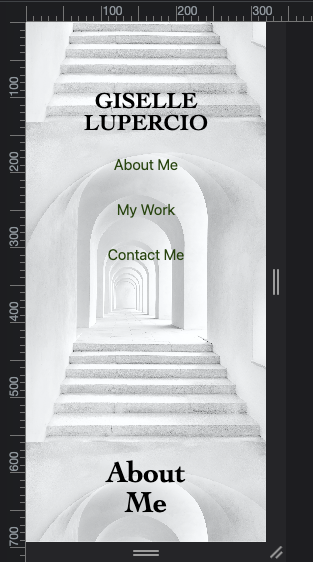
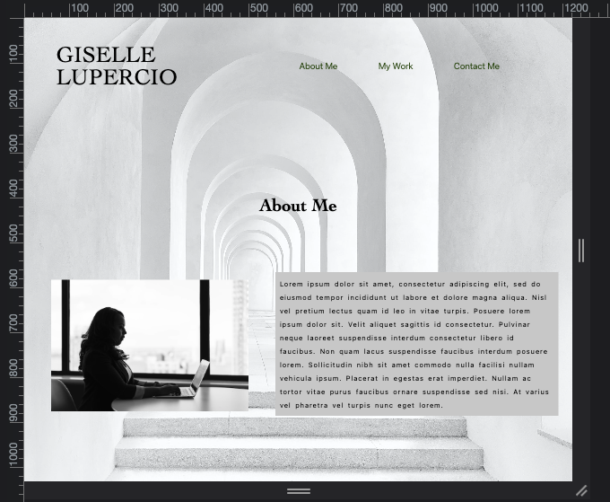

# challenge-2-portfolio

## Description

I built this project to demonstrate that I can build a static website using html and CSS. In this project I used flexbox for my layout and included a media query for smaller screens; both of which made for a responsive website. The image below "Group Project 1: Sunny Search" is a link to the group project application.

## Usage

Resize browser to see how the elements on the page change. Click on the links to view different sections of the page. Click on the image below "Group Project 1: Sunny Search" to check out the application I worked on with my group.

## Link to Application

https://perfectblue0.github.io/challenge-2-portfolio/

## Link to Repo

https://github.com/perfectblue0/challenge-2-portfolio

## Credits

reset.css from: 

https://meyerweb.com/eric/tools/css/reset/index.html

## License

Please refer to license in the repo.
